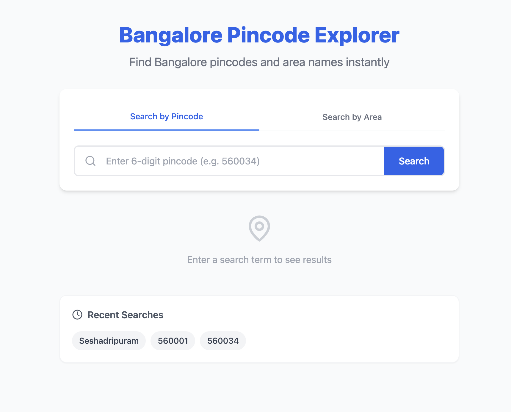

# Bangalore Pincode Explorer

A lightweight, minimal, and clean full-stack web application to easily search for Bangalore area names by pincode and vice versa.

## Project Overview

This project provides a beginner-friendly way to query a static dataset of over 80+ Bangalore pincodes. It features a modern, responsive UI where users can switch between searching by a 6-digit pincode or a partial area name. It handles empty states, loading states, and missing results gracefully.



## Features

- **Search by Pincode**: Enter a 6-digit numeric pincode to find its corresponding area.
- **Search by Area**: Enter partial text to find all matching areas and their pincodes.
- **Toggle Search Mode**: Clean tabbed interface to switch between search methods.
- **Error Handling**: Graceful error UI for invalid inputs or "No results found".
- **Responsive UI**: A minimal, beautiful card layout using Tailwind CSS.
- **Search History (Bonus)**: Automatically saves your recent searches using `localStorage`.
- **Copy Pincode (Bonus)**: One-click button to copy a pincode to your clipboard.

## Tech Stack

- **Frontend**: React (Vite), Tailwind CSS, Axios, Lucide React (Icons)
- **Backend**: Node.js, Express.js, CORS
- **Data**: Static JSON file (No database required)

## Folder Structure

```
bangalore-pincode-explorer/
├── client/                 # React frontend (Vite)
│   ├── public/             
│   ├── src/                
│   │   ├── App.jsx         # Main application logic
│   │   ├── index.css       # Tailwind entry and custom styles
│   │   └── main.jsx        
│   ├── package.json        
│   ├── tailwind.config.js  
│   └── vite.config.js      # Vite config (includes proxy to backend)
├── server/                 # Node.js Express backend
│   ├── data.json           # Static dataset (80+ pincodes)
│   ├── index.js            # Express server and API endpoints
│   └── package.json        
└── README.md
```

## Setup Instructions

Follow these steps to run the application locally.

### 1. Clone the repository
```bash
git clone <repository-url>
cd bangalore-pincode-explorer
```

### 2. Setup the Backend
Open a new terminal window:
```bash
cd server
npm install
node index.js
```
*The server will start running on `http://localhost:3000`.*

### 3. Setup the Frontend
Open another terminal window:
```bash
cd client
npm install
npm run dev
```
*The React app will start running on `http://localhost:5173`. Open this URL in your browser.*

## API Endpoints

The backend exposes the following REST APIs:

- `GET /api/pincode/:code`
  - Returns exact match for a 6-digit pincode.
  - Example: `/api/pincode/560034` -> `{ "pincode": "560034", "area": "Koramangala" }`

- `GET /api/area/:name`
  - Returns partial, case-insensitive matches for an area name.
  - Example: `/api/area/koram` -> `[{ "pincode": "560034", "area": "Koramangala" }]`

- `GET /api/all`
  - Returns the complete dataset of all Bangalore pincodes.

---
*Built with ❤️ using React and Node.js.*
